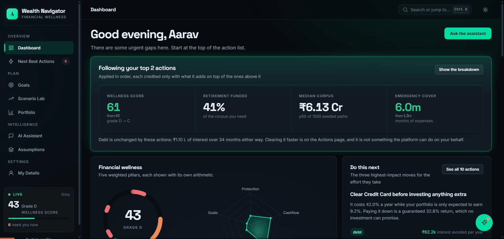

# AI Wealth Navigator

[](https://github.com/Deepak17kb/BroadBridge/actions/workflows/ci.yml)
[](https://github.com/Deepak17kb/BroadBridge/actions/workflows/pages.yml)


An AI-powered financial wellness platform. It reads a user's actual position, projects every goal, lets them explore what-if scenarios against thousands of simulated markets, and produces ranked next-best actions — each one showing the arithmetic and the assumptions behind it.

### ▶ **[Try it live →](https://deepak17kb.github.io/BroadBridge/)**

No install, no sign-up. Pick a sample profile and the whole platform lights up — every figure computed in your browser by the same engine the server runs.

**All data is synthetic. Nothing here is financial advice.**

---

## The demo, in five minutes

▶ **[Watch the full walkthrough (MP4)](docs/media/broadbridge-demo.mp4)** — 5 minutes, no narration, so it can be presented over.



It covers the dashboard and what the advice is worth, the wellness pillars and their arithmetic, goal funding, a −30% market crash applied live in the Scenario Lab, the ranked actions, and the agent answering a question with its reasoning trace and a grounding check on every figure.

The presenter's script — the words to say, the timings, and the questions to expect — is in **[docs/DEMO_SCRIPT_5MIN.md](docs/DEMO_SCRIPT_5MIN.md)**, and the full component-by-component deck (45 slides, with speaker notes on every one) is **[docs/BroadBridge-Walkthrough.pptx](docs/BroadBridge-Walkthrough.pptx)**.

---

## Run it in two commands

```bash
npm install
npm run dev
```

Open <http://localhost:5173>. Pick a sample profile or enter your own numbers.

**No API key is needed.** With no credentials the agent still classifies the question, plans a toolchain, runs the financial engine and answers with grounded figures — it just narrates through a rule-based synthesiser instead of a model. Add credentials to switch the language model on:

```bash
export ANTHROPIC_API_KEY=sk-ant-...   # or GROQ_API_KEY=gsk_... for open-weights models
```

The active engine is shown in the sidebar and returned by `GET /api/health`, so it is never ambiguous which one produced an answer.

---

## What it does

| | |
|---|---|
| **Onboarding** | Five-step wizard, or one click to load a sample profile. The wellness score and surplus update live as you type. |
| **Dashboard** | Wellness score across five weighted pillars, net worth, cashflow, goal funding, allocation versus target, retirement readiness. |
| **Goals** | Per-goal projection with inflation applied to the target date. Test a contribution change with sliders, then commit it. |
| **Scenario Lab** | Nine levers — save more, spend less, retire earlier, lump sum, market crash, career break, inflation, pay rise, allocation. Every drag re-runs the model in the browser. Pin scenarios to compare them. |
| **Portfolio** | Covariance-based volatility, drift from target, exact rebalancing trades, fee drag, concentration on single securities only, avalanche vs snowball debt payoff. |
| **Next Best Actions** | Twelve rule checks producing ranked, quantified actions. Each has an **Apply to my plan** button that actually mutates the plan. |
| **AI Assistant** | Ask in plain language. The reasoning trace shows the plan, every tool call with timing, retrieved knowledge, and a grounding check on every figure in the answer. |
| **Assumptions** | Every assumption the platform uses, editable. Change inflation or the withdrawal rate and the whole plan re-scores. Includes what is deliberately *not* modelled. |

---

## Architecture in one picture

```
   Full stack (npm run dev)              Static (GitHub Pages)
   ─────────────────────────             ─────────────────────
   React client  :5173                   React client
        │  /api/*                             │
        ▼                                     ▼
   Express + agent  :4000              staticApi.ts  ── localStorage
        │        │                            │
        │        └──► Claude / Groq           │
        ▼                                     ▼
   ┌──────────────────────────────────────────────────┐
   │   @wealth/shared — the finance engine            │
   │   projections · Monte Carlo · actions · scoring  │
   └──────────────────────────────────────────────────┘
```

**The load-bearing idea:** one financial engine, `@wealth/shared`, imported as TypeScript source by the browser and the server alike.

- The browser runs it for instant slider feedback — no round trip to see a what-if.
- The agent's tools call the same functions server-side.
- On GitHub Pages, where there is no server at all, the client answers its own calls from that same engine — so the numbers are identical rather than approximated.
- There is no second implementation, so the number on the slider and the number the AI quotes cannot disagree.

**The second load-bearing idea:** the model narrates, it never calculates. Every figure comes from a tool result, and a verifier re-checks each number in the answer against the tool outputs that produced it. Unmatched figures are reported as unverified rather than trusted.

Full detail, including the decisions and their trade-offs: **[docs/ARCHITECTURE.md](docs/ARCHITECTURE.md)**.

---

## Repository layout

```
packages/
  shared/    Domain types, market assumptions, the whole finance engine + 106 tests
  server/    Express API, agent orchestrator, tools, BM25 retrieval + 91 tests
  web/       React 18 + Vite client + 42 render and a11y tests
               lib/api.ts        the network client
               lib/staticApi.ts  the same surface, answered in the browser
docs/        Architecture, API reference, demo scripts, slide deck, demo recording
.github/     ci.yml (typecheck, test, build) and pages.yml (publish the static site)
```

---

## Commands

```bash
npm run dev         # API on :4000 and the client on :5173, both watching
npm run typecheck   # All three packages
npm test            # 239 tests: engine arithmetic, API + agent, page renders
npm run lint        # ESLint, zero warnings tolerated
npm run build       # Server bundle + static client bundle
npm run verify      # typecheck + test + build, the same gate CI runs
```

---

## Deploying

The live site is published by **[.github/workflows/pages.yml](.github/workflows/pages.yml)** on every push to `main`. It needs no secrets:

```bash
VITE_STATIC=true VITE_BASE=/BroadBridge/ npm run build --workspace @wealth/web
```

`VITE_STATIC` selects `staticApi.ts`, so the bundle answers its own calls from the shared engine and keeps the profile in `localStorage`. `VITE_BASE` sets the project-site path, and `404.html` is a copy of `index.html` because Pages has no rewrite rules and a deep link would otherwise die on refresh.

**The one thing the static build cannot do is the AI assistant.** It needs a model, a model needs a key, and a key in a public bundle is a key anyone can read — so it says so rather than pretending. Run locally for that.

To host the full stack instead — a public URL **with** the assistant working — any Node host will do: `npm run build`, then `npm start --workspace @wealth/server` with the client served statically and `/api` proxied to it.

Step by step for all three targets, plus every environment variable and a troubleshooting table: **[docs/DEPLOYMENT.md](docs/DEPLOYMENT.md)**.

---

## What is tested

239 tests, all runnable with `npm test` and no credentials.

**Engine (106)** — the maths is the product, so it is tested as such. Solver round-trips (the contribution the engine says is required is fed back through the projection and must land on the target), reproducibility of every seeded simulation, percentile band ordering, and the variance-drag correction that stops a Monte Carlo from silently overstating the median. Invariants hold for all three personas: net worth reconciles, pillar weights sum to 1, allocations sum to 1, actions arrive ranked and every one carries assumptions.

**API and agent (91)** — real HTTP against a listening server, so serialisation and status codes are exercised. Intent routing, natural-language lever extraction, BM25 retrieval accuracy, every tool's output shape, the grounding verifier, SSE frame validity, and a full conversation round-trip. One test asserts that the persona with 42% credit-card debt is told to clear it before investing.

**Client (42)** — every page server-side rendered for all three personas plus an empty profile, asserting no `NaN`, `undefined` or `Infinity` reaches the user. This is the layer a typecheck cannot cover.

---

## Deliberate limitations

Stated because an unstated omission is a misleading result. The Assumptions page lists these in the product too.

- **No taxes.** No capital gains, dividend or income tax on any projection. Real after-tax outcomes are lower.
- **No transaction costs.** Brokerage, exit loads, spreads and rebalancing costs are excluded.
- **Thin tails.** Returns are log-normal and drawn independently. Real markets crash harder, more often, and in clusters.
- **Synthetic data only.** No real market data, no real accounts, no institution integrated.
- **Not advice.** Illustrative planning output from a hackathon build, not a regulated recommendation.

---

## Licence

Built for a hackathon. Synthetic data throughout.
